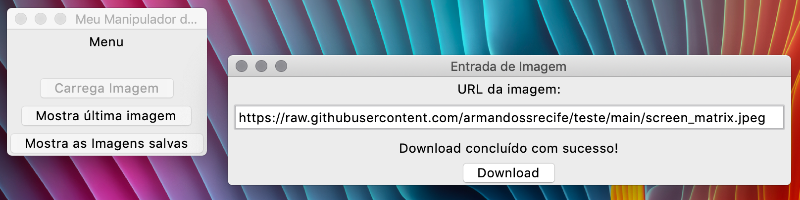
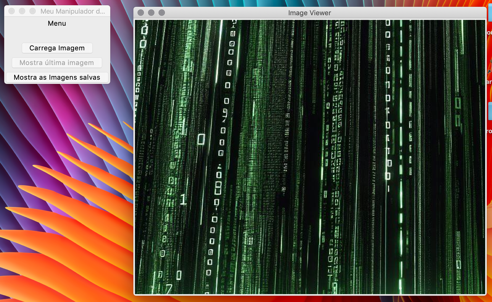
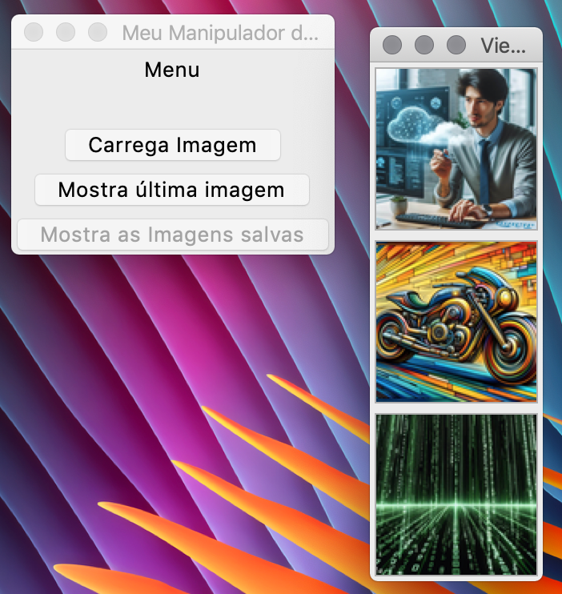
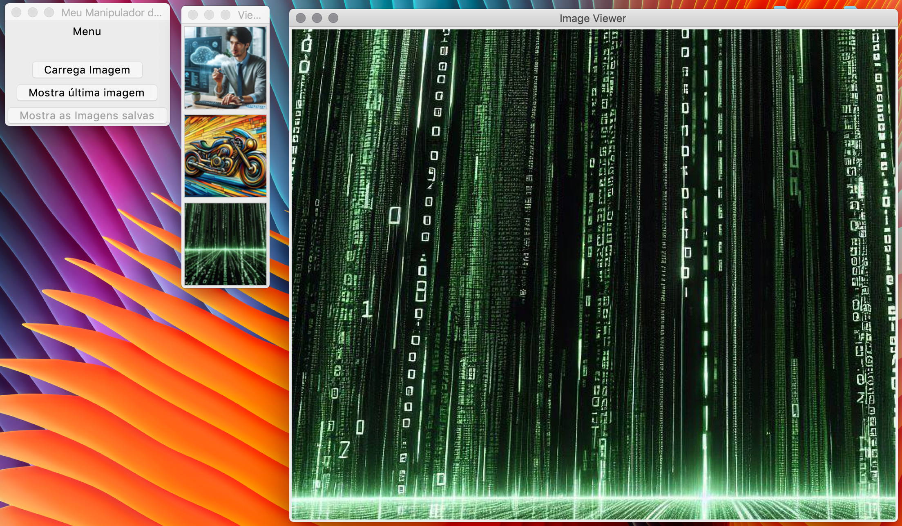

# My GUI Images

Aplicação desktop em Python e Tkinter para baixar, organizar e visualizar imagens
em uma interface unificada.

## Funcionalidades

- Download de imagens por URL sem bloquear a interface gráfica.
- Barra de progresso com percentual e volume baixado na janela de entrada.
- Validação do protocolo, da extensão, do `Content-Type` e do conteúdo da imagem.
- Suporte a arquivos JPG, JPEG, PNG, GIF, BMP e WebP.
- Limite de 25 MiB por download, verificado pelo cabeçalho e pelos bytes recebidos.
- Cancelamento do download quando a janela de entrada é fechada.
- Reserva atômica de nomes para impedir a sobrescrita de arquivos existentes.
- Gravação inicial em arquivo temporário `.part`; a imagem somente é publicada depois de
  ser completamente baixada e validada.
- Visualização da imagem mais recente e de todas as imagens salvas.
- Biblioteca responsiva em grade, com miniaturas, dimensões e seleção visual.
- Visualizador integrado com ajuste à janela, tamanho real, zoom e movimentação.
- Navegação por teclado e estados claros de progresso, sucesso, erro e cancelamento.
- Miniaturas e visualizações redimensionadas com `PIL.Image.Resampling.LANCZOS`.

As imagens são armazenadas no diretório `imagens/` localizado ao lado dos arquivos do
projeto. Esse caminho não depende do diretório a partir do qual o programa foi iniciado.

## Requisitos

- Python 3.13 ou superior.
- Tcl/Tk e Tkinter disponíveis na instalação do Python.
- [uv](https://docs.astral.sh/uv/) — recomendado — ou `pip`.

As dependências Python são declaradas em `pyproject.toml` e fixadas em `uv.lock`:

- Pillow;
- Requests;
- tqdm.

Antes de instalar as dependências, confirme que a distribuição Python consegue abrir
uma janela Tk:

```bash
python3 -m tkinter
```

Se esse comando falhar, instale uma distribuição Python com suporte ao Tk. No macOS,
o instalador oficial do [python.org](https://www.python.org/downloads/macos/) inclui
esse suporte. Em distribuições Debian/Ubuntu, instale o pacote `python3-tk`.

## Instalação e execução com uv

Crie o ambiente usando uma distribuição Python que tenha Tkinter e sincronize as
versões registradas no arquivo de lock:

```bash
uv venv --python python3
uv sync --locked
```

Execute a aplicação:

```bash
uv run python main.py
```

## Instalação e execução com pip

Crie e ative um ambiente virtual:

```bash
python3 -m venv .venv
source .venv/bin/activate
```

No Windows, use `.venv\Scripts\activate` para ativar o ambiente.

Instale o projeto e execute a aplicação:

```bash
python -m pip install .
python main.py
```

## Uso

- Cole uma URL direta no formulário e pressione `Enter` ou **Baixar imagem**.
- Selecione qualquer miniatura para exibi-la no painel de visualização.
- Use **Ajustar**, **100%**, `+` e `−` para controlar a visualização.
- Arraste uma imagem ampliada para navegar por ela.

### Atalhos

| Atalho | Ação |
| --- | --- |
| `Ctrl+L` | Focar o campo de URL |
| `Enter` | Iniciar o download |
| `Ctrl++` / `Ctrl+-` | Aumentar ou reduzir o zoom |
| `Ctrl+0` | Exibir em tamanho real |
| `Ctrl+F` | Ajustar a imagem à janela |
| `Esc` | Cancelar o download em andamento |

## Testes

Execute a suíte com:

```bash
uv run python -m unittest discover -v
```

Os testes cobrem:

- geração concorrente de nomes sem colisões;
- publicação da imagem somente após a validação;
- rejeição de downloads acima do limite;
- cancelamento e remoção de arquivos incompletos;
- formatação dos indicadores de tamanho;
- cálculo da grade responsiva;
- ajuste proporcional e limite seguro de zoom;
- compatibilidade da fachada pública após a divisão em módulos.

## Estrutura do projeto

```text
.
├── main.py                 # Ponto de entrada da aplicação
├── gui.py                  # Composição principal e fachada compatível
├── entidades.py            # Utilitários, validação e download
├── ui/
│   ├── constants.py        # Tokens visuais e limites de renderização
│   ├── helpers.py          # Cálculos puros e formatação
│   ├── theme.py            # Tema ttk e tooltips
│   ├── download_panel.py   # Formulário e estado do download
│   ├── gallery_panel.py    # Grade responsiva de miniaturas
│   └── image_viewer.py     # Visualização, zoom e movimentação
├── imagens/                # Imagens salvas pela aplicação
├── tests/
│   ├── test_entidades.py   # Regras de download e arquivos
│   ├── test_gui_helpers.py # Cálculos independentes da interface
│   └── test_gui_modules.py # Contrato público entre os módulos
├── docs/                   # Capturas de tela e documentação visual
├── pyproject.toml          # Metadados e dependências
└── uv.lock                 # Versões resolvidas das dependências
```

Mais informações sobre as classes estão em [detalhes.md](detalhes.md).

## Interface

A aplicação utiliza uma única janela com três áreas:

1. formulário e progresso do download;
2. biblioteca responsiva de miniaturas;
3. visualizador com informações e controles de zoom.

As imagens abaixo registram a versão original e foram mantidas como referência
histórica da modernização.

### Interface original

#### Tela principal



#### Visualização de imagem



#### Lista de imagens



#### Imagem selecionada


