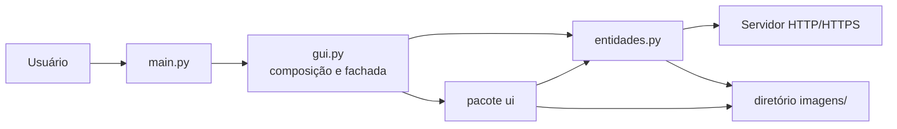
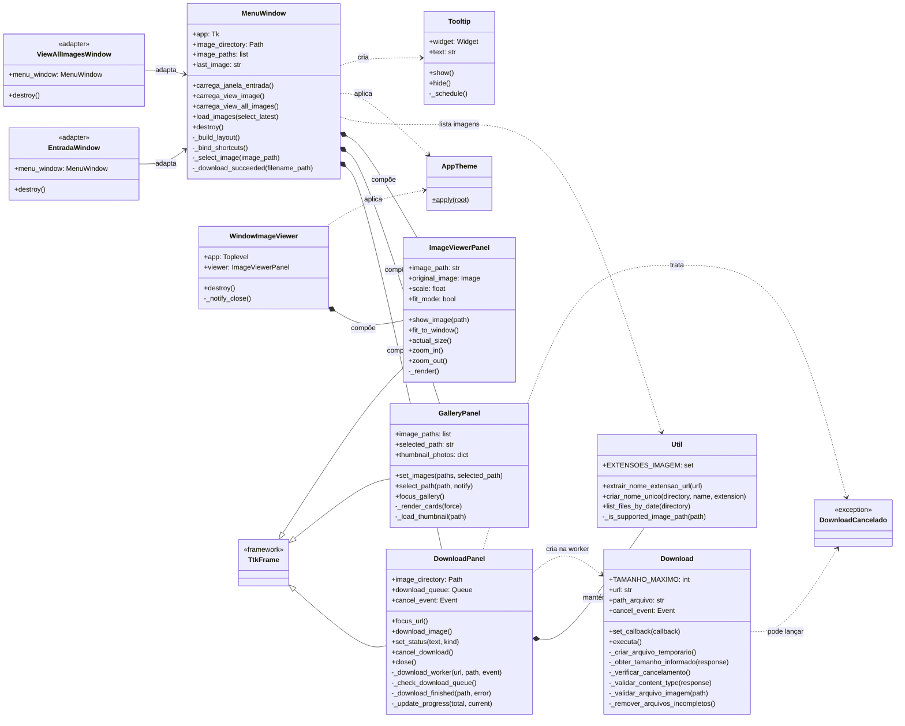
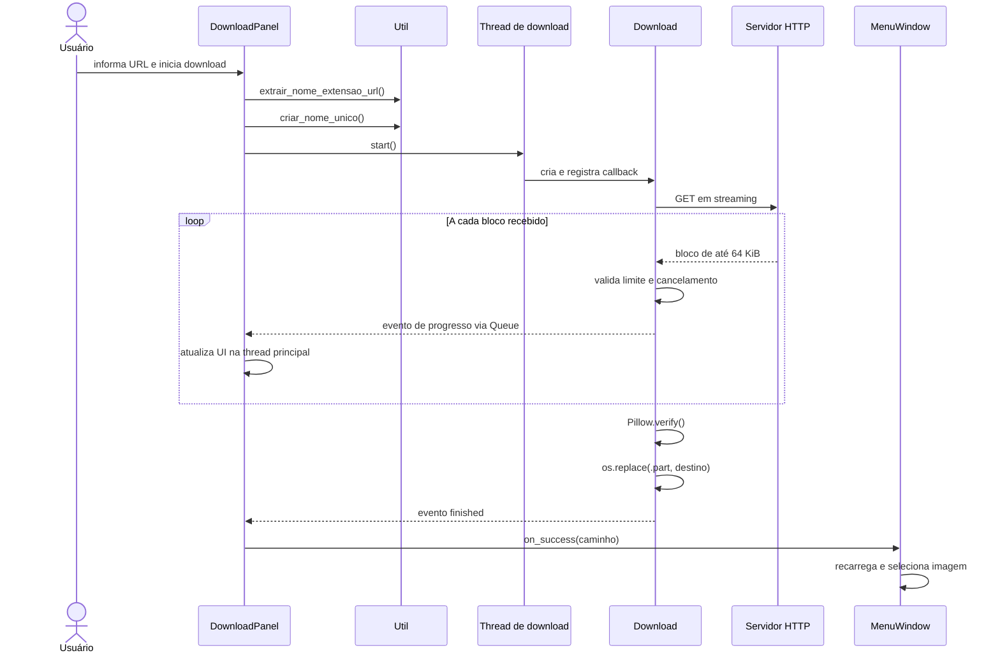

# Documentação técnica — My GUI Images

| Item | Valor |
| --- | --- |
| Projeto | `my-gui-images` |
| Versão documentada | `0.1.0` |
| Plataforma | Aplicação desktop |
| Linguagem | Python 3.13+ |
| Interface | Tkinter / ttk |
| Atualização desta documentação | 27 de junho de 2026 |

## 1. Objetivo e escopo

O My GUI Images permite baixar imagens por URL, armazená-las localmente,
organizá-las em uma biblioteca visual e inspecioná-las com controles de zoom.

Esta documentação descreve:

- a arquitetura e as dependências do software;
- as responsabilidades dos módulos e classes;
- os relacionamentos UML;
- os fluxos de download, seleção e visualização;
- o modelo de concorrência;
- as regras de validação e persistência;
- a estratégia de testes;
- os pontos previstos para manutenção e extensão.

## 2. Visão arquitetural

A aplicação utiliza uma arquitetura desktop orientada a componentes:

1. `main.py` cria a janela raiz e inicia o loop de eventos;
2. `gui.py` compõe os componentes e preserva a API pública histórica;
3. o pacote `ui` contém componentes visuais independentes;
4. `entidades.py` concentra regras de arquivos, validação e download;
5. o diretório `imagens/` funciona como armazenamento persistente.

Não há banco de dados nem servidor local. O estado persistente é a própria coleção
de arquivos de imagem.



## 3. Tecnologias e dependências

| Tecnologia | Responsabilidade |
| --- | --- |
| Python 3.13+ | Runtime da aplicação |
| Tkinter / ttk | Janela, widgets, estilos e loop de eventos |
| Pillow | Validação, leitura, miniaturas e redimensionamento |
| Requests | Comunicação HTTP/HTTPS em streaming |
| tqdm | Progresso no terminal durante o download |
| unittest | Testes automatizados |
| uv | Ambiente, lock de dependências e execução |

As dependências diretas e suas restrições estão em `pyproject.toml`. As versões
resolvidas ficam registradas em `uv.lock`.

## 4. Organização do código

```text
.
├── main.py
├── gui.py
├── entidades.py
├── ui/
│   ├── __init__.py
│   ├── constants.py
│   ├── helpers.py
│   ├── theme.py
│   ├── download_panel.py
│   ├── gallery_panel.py
│   └── image_viewer.py
├── imagens/
├── tests/
│   ├── test_entidades.py
│   ├── test_gui_helpers.py
│   └── test_gui_modules.py
└── docs/
```

### 4.1 `main.py`

Ponto de entrada. Cria `tk.Tk`, instancia `MenuWindow` e chama `mainloop`.

### 4.2 `gui.py`

Fachada pública e raiz de composição da interface.

- `MenuWindow`: coordena download, biblioteca e visualizador;
- `WindowImageViewer`: visualizador independente compatível com a API anterior;
- `EntradaWindow`: adaptador que direciona o foco ao formulário integrado;
- `ViewAllImagesWindow`: adaptador que direciona o foco à biblioteca integrada.

O módulo também reexporta componentes e helpers que eram acessíveis por `gui`,
evitando quebra imediata de integrações existentes.

### 4.3 `entidades.py`

Camada sem dependência de Tkinter:

- `Util`: URL, reserva de nomes e listagem de arquivos;
- `Download`: streaming, validações, progresso e publicação do arquivo;
- `DownloadCancelado`: sinaliza cancelamento solicitado pelo usuário.

### 4.4 Pacote `ui`

| Módulo | Responsabilidade |
| --- | --- |
| `constants.py` | Cores, tipografia, miniaturas e limite de renderização |
| `helpers.py` | Funções puras para tamanhos, grade e escala |
| `theme.py` | Estilos ttk e tooltip |
| `download_panel.py` | Formulário, thread, fila e estados do download |
| `gallery_panel.py` | Grade responsiva, miniaturas e seleção |
| `image_viewer.py` | Abertura, zoom, ajuste, rolagem e pan |

## 5. Diagrama UML de classes

O diagrama apresenta as relações relevantes da aplicação. A composição indica
objetos criados e mantidos por outra classe. Dependências tracejadas indicam uso
temporário ou criação durante uma operação.



### 5.1 Callbacks entre componentes

Os componentes visuais não importam `MenuWindow`. A comunicação inversa ocorre
por callbacks fornecidos durante a composição:

- `DownloadPanel.on_success` chama `MenuWindow._download_succeeded`;
- `GalleryPanel.on_select` chama `MenuWindow._select_image`.

Isso reduz acoplamento e permite substituir ou testar os painéis separadamente.

## 6. Fluxos de execução

### 6.1 Inicialização

1. `main()` cria a janela raiz;
2. `MenuWindow` aplica o tema;
3. os três painéis são adicionados a um `ttk.Panedwindow`;
4. `Util.list_files_by_date` consulta `imagens/`;
5. a galeria é preenchida;
6. a imagem mais recente, quando existente, é selecionada;
7. o loop de eventos do Tkinter é iniciado.

### 6.2 Download de imagem



### 6.3 Seleção e visualização

1. `GalleryPanel` recebe a lista ordenada por data;
2. a apresentação é invertida para exibir primeiro as imagens mais recentes;
3. o clique ou `Enter` chama `select_path`;
4. o callback informa o caminho a `MenuWindow`;
5. `ImageViewerPanel.show_image` copia a imagem para memória;
6. a escala inicial é calculada para ajustar a imagem à área disponível;
7. zoom e redimensionamento geram uma nova imagem com filtro LANCZOS.

## 7. Concorrência e segurança da interface

Tkinter exige que widgets sejam manipulados apenas pela thread principal. O
projeto cumpre essa restrição da seguinte forma:

- `DownloadPanel` cria uma thread daemon somente para rede e arquivo;
- a worker nunca altera widgets;
- progresso e conclusão são enviados por `queue.Queue`;
- `_check_download_queue` consulta a fila a cada 100 ms usando `after`;
- todos os estados visuais são atualizados na thread principal.

O cancelamento utiliza `threading.Event`. A flag é verificada entre blocos, antes
da validação e antes da publicação. Uma requisição bloqueada pode aguardar até o
timeout configurado em Requests: 5 segundos para conexão e 30 para leitura.

## 8. Persistência e ciclo de vida dos arquivos

O diretório padrão é calculado a partir da localização de `gui.py`:

```text
<raiz-do-projeto>/imagens/
```

O ciclo de publicação evita imagens parciais:

1. `Util.criar_nome_unico` reserva atomicamente o destino com
   `os.O_CREAT | os.O_EXCL`;
2. `Download` cria um arquivo oculto temporário `.part` no mesmo diretório;
3. os bytes são gravados no arquivo temporário;
4. Pillow verifica a estrutura da imagem;
5. `os.replace` publica atomicamente o arquivo validado no destino reservado;
6. em erro ou cancelamento, temporários e reservas vazias são removidos.

Nomes repetidos recebem timestamp com microssegundos e um índice. A listagem
aceita apenas arquivos não vazios com extensões suportadas.

## 9. Validação, limites e tratamento de erros

### 9.1 Regras de entrada

- protocolos aceitos: `http` e `https`;
- a URL deve possuir nome e extensão no caminho;
- extensões: `.jpg`, `.jpeg`, `.png`, `.gif`, `.bmp` e `.webp`.

### 9.2 Regras de resposta

- respostas HTTP com erro são rejeitadas;
- um `Content-Type` presente deve começar com `image/`;
- `Content-Length`, quando presente, não pode ultrapassar 25 MiB;
- a contagem efetiva dos bytes também respeita 25 MiB;
- o conteúdo final deve ser reconhecido por `PIL.Image.verify`.

### 9.3 Proteção de renderização

`calculate_safe_zoom_limit` limita a imagem renderizada a aproximadamente
36 milhões de pixels. Esse limite reduz o risco de consumo excessivo de memória
durante o zoom, independentemente do tamanho comprimido do arquivo.

### 9.4 Propagação de erros

`Download` converte falhas de rede, arquivo e validação em mensagens adequadas à
interface. `DownloadCancelado` permanece separado para que cancelamento seja
apresentado como estado esperado, e não como falha.

## 10. Contratos públicos

### 10.1 `MenuWindow`

Construtor:

```python
MenuWindow(my_app, my_title, image_directory=IMAGE_DIRECTORY)
```

`image_directory` pode ser substituído em testes ou integrações. Os métodos
`carrega_janela_entrada`, `carrega_view_image` e `carrega_view_all_images`
continuam disponíveis.

### 10.2 `Download`

Uso básico:

```python
download = Download(url, destination, cancel_event=event)
download.set_callback(lambda total, current: ...)
download.executa()
```

O callback recebe tamanho total e quantidade baixada. Quando o servidor não envia
`Content-Length`, o total é zero.

### 10.3 Compatibilidade

`gui.py` reexporta `AppTheme`, os três painéis e as funções de `ui.helpers`.
Os adaptadores `EntradaWindow`, `ViewAllImagesWindow` e `WindowImageViewer`
preservam os nomes usados pela versão anterior.

## 11. Configuração

Os valores visuais e operacionais ficam centralizados:

| Constante | Local | Finalidade |
| --- | --- | --- |
| `IMAGE_DIRECTORY` | `gui.py` | Diretório padrão da biblioteca |
| `COLORS` | `ui/constants.py` | Paleta visual |
| `FONT_FAMILY` | `ui/constants.py` | Fonte base |
| `THUMBNAIL_SIZE` | `ui/constants.py` | Área da miniatura |
| `MAX_RENDER_PIXELS` | `ui/constants.py` | Limite de renderização |
| `Download.TAMANHO_MAXIMO` | `entidades.py` | Limite do arquivo baixado |
| `Util.EXTENSOES_IMAGEM` | `entidades.py` | Formatos aceitos |

## 12. Estratégia de testes

A suíte utiliza `unittest` e está dividida por responsabilidade:

| Arquivo | Cobertura |
| --- | --- |
| `test_entidades.py` | concorrência de nomes, publicação, limite e cancelamento |
| `test_gui_helpers.py` | bytes, colunas, ajuste e limite de zoom |
| `test_gui_modules.py` | reexportações e compatibilidade da fachada |

As requisições HTTP são substituídas por `FakeResponse` e `unittest.mock.patch`.
Arquivos são criados em `TemporaryDirectory`, evitando dependência da biblioteca
real do usuário.

Execução:

```bash
uv run python -m unittest discover -v
```

Também é recomendada uma validação manual em macOS, Windows e Linux para eventos
de mouse, atalhos, tema nativo e escalas de tela. Essa validação exige uma
instalação Python com Tcl/Tk funcional.

## 13. Manutenção e extensão

### Adicionar um formato

1. incluir a extensão em `Util.EXTENSOES_IMAGEM`;
2. confirmar suporte de leitura e verificação no Pillow;
3. atualizar o texto do `DownloadPanel`;
4. adicionar casos de teste.

### Alterar o tema

Modificar tokens em `ui/constants.py` e estilos em `ui/theme.py`. Os painéis
devem consumir os estilos compartilhados em vez de definir novas cores locais.

### Criar um novo painel

1. criar um módulo dedicado em `ui/`;
2. herdar de `ttk.Frame`;
3. receber callbacks em vez de importar `MenuWindow`;
4. compor o painel em `MenuWindow._build_layout`;
5. atualizar o diagrama e os testes de contrato.

### Alterar o mecanismo de download

Manter o contrato esperado por `DownloadPanel`: callback de progresso,
cancelamento por `Event`, exceção distinguível para cancelamento e retorno somente
depois da publicação do arquivo validado.

## 14. Restrições conhecidas

- Tkinter/Tcl precisa estar presente na distribuição Python;
- a biblioteca é baseada em arquivos e não possui busca, tags ou paginação;
- miniaturas são mantidas em memória durante a sessão;
- URLs sem extensão de imagem no caminho são rejeitadas, mesmo que o servidor
  retorne um conteúdo visual válido;
- GIFs animados são representados pelo quadro carregado pelo Pillow;
- os testes automatizados atuais não criam janelas reais.

## 15. Checklist para alterações

- preservar atualizações de widgets na thread principal;
- não publicar o destino antes da validação;
- remover temporários em todos os caminhos de erro;
- manter `gui.py` como fachada compatível;
- criar funções puras para cálculos que não dependam de Tkinter;
- atualizar testes, README e esta documentação;
- executar compilação e suíte antes da entrega.
